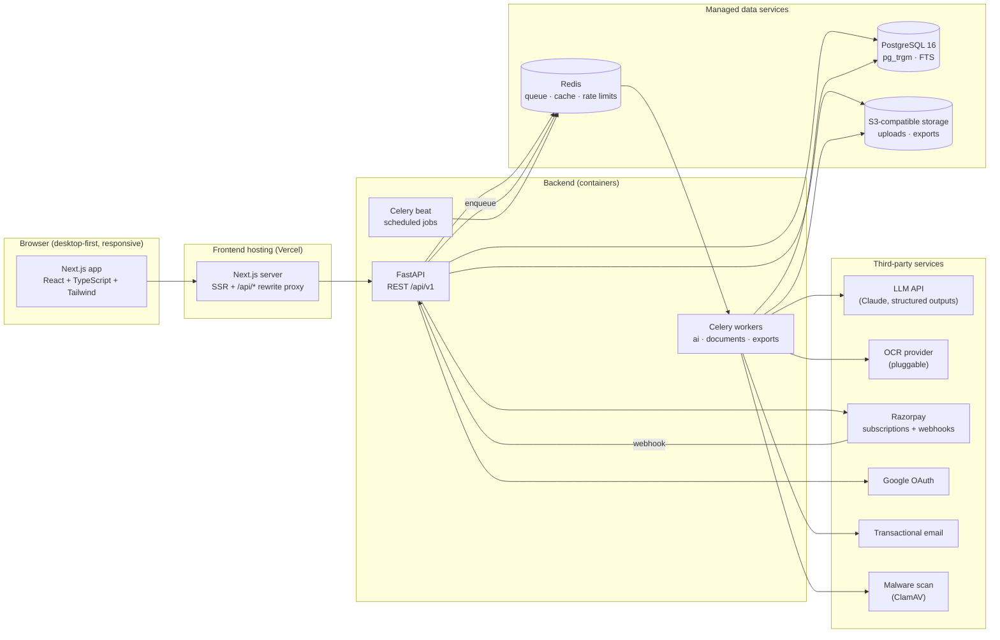
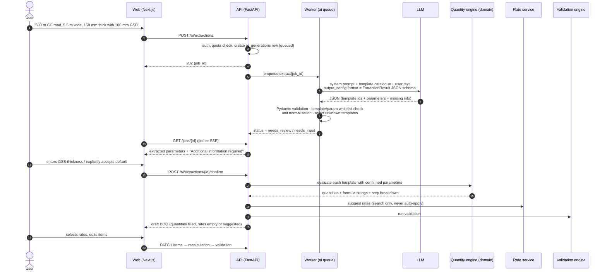

# 01 — System Architecture

> Status: **Design draft for review.** No application code is written until this package is confirmed.

## 1.1 Design principles

These principles decide every trade-off below. They come straight from the product brief.

| # | Principle | Consequence in the architecture |
|---|-----------|--------------------------------|
| P1 | **AI interprets, the application calculates, the user verifies.** | The LLM only produces *parameters* and *template choices*. All arithmetic is done by a deterministic, unit-tested Python engine using `Decimal`. |
| P2 | **Every important number is traceable.** | Every quantity stores its formula, input parameters, units, engine version and provenance. Every rate stores its source, SOR, year and effective period. |
| P3 | **Nothing is silently invented.** | Missing parameters block calculation until the user enters a value or explicitly accepts a default. The acceptance is audited. The AI never supplies rates. |
| P4 | **Data is configurable.** | Rates, GST, charges, units, conversions, plans, prompts and feature flags live in the database, not in code. |
| P5 | **Long work is asynchronous.** | OCR, document extraction, AI calls, PDF/Excel/DOCX generation run as background jobs with progress reporting. |
| P6 | **Tenancy and authorisation are enforced server-side.** | Every query is scoped by organisation and project membership. The frontend is never trusted. |

## 1.2 High-level component diagram



**Why this shape**

* **Next.js proxies `/api/*` to FastAPI** so that auth cookies are first-party (`SameSite=Lax`, `HttpOnly`, `Secure`) and no API key or backend secret is ever in browser code.
* **FastAPI is the single source of business logic.** Next.js does no calculation beyond display formatting. The quantity engine, estimate engine and validation engine run only on the server, so exports, the UI and the AI assistant always see the same numbers.
* **Celery + Redis** is chosen over lighter queues because we need retries, per-queue concurrency (AI calls are rate-limited, exports are CPU-heavy), scheduled tasks (usage-counter resets, subscription reconciliation) and a mature monitoring story. Queues: `ai`, `documents`, `exports`, `default`.
* **PostgreSQL** does relational integrity, full-text + trigram search (rate search, global search) and JSONB for AI payloads. No separate search engine or vector DB is needed for MVP. `pgvector` can be added in Phase 2 for semantic search over document chunks.

## 1.3 Backend internal layering

```
┌──────────────────────────────────────────────────────────────────────┐
│ api/            FastAPI routers · request/response schemas · deps     │  ← HTTP only
├──────────────────────────────────────────────────────────────────────┤
│ services/       use-cases: ProjectService, EstimateService,           │  ← orchestration,
│                 AIExtractionService, RateService, ExportService …     │    transactions,
│                                                                       │    authorisation,
│                                                                       │    audit logging
├──────────────────────────────────────────────────────────────────────┤
│ domain/         PURE PYTHON, no I/O, no DB, no HTTP:                  │  ← 100 % unit-
│   quantity/     formula parser + evaluator, templates                 │    testable,
│   units/        unit registry + conversion (data injected)            │    deterministic
│   estimate/     totals, GST, charges, abstract, rounding              │
│   validation/   rule engine → findings (GREEN/YELLOW/RED)             │
│   money/        Indian number format, amount-in-words                 │
├──────────────────────────────────────────────────────────────────────┤
│ ai/             LLM client wrapper, prompt registry, JSON schemas,    │  ← never calculates
│                 model router, usage metering, response cache          │
├──────────────────────────────────────────────────────────────────────┤
│ repositories/   SQLAlchemy 2.0 queries, always tenant-scoped          │
│ models/         SQLAlchemy ORM models                                 │
├──────────────────────────────────────────────────────────────────────┤
│ integrations/   storage (S3), ocr (provider adapters), payments       │
│                 (Razorpay), email, malware scanning                   │
├──────────────────────────────────────────────────────────────────────┤
│ workers/        Celery tasks — thin wrappers that call services       │
└──────────────────────────────────────────────────────────────────────┘
```

Rule: `domain/` never imports from any other layer. This is what makes the calculation engine auditable and testable in isolation, and lets us publish its version number on every calculation.

## 1.4 The AI → calculation pipeline (critical path)



**Key rules enforced in code, not just in prompts**

1. The LLM response must validate against a strict JSON schema (Anthropic structured outputs, `output_config.format`) **and** a second Pydantic validation on our side. Invalid → retried once, then surfaced as `AI_OUTPUT_INVALID`; never displayed raw.
2. The LLM may only reference `template_id`s from the catalogue we send. Anything else becomes a `custom_item` with **no quantity** and `provenance = ai_suggested`, requiring manual entry.
3. Any number the LLM returns is a *parameter*, never a quantity or rate. Quantity/amount fields in LLM output are discarded if present.
4. Each parameter carries `source_text` (the span of user text it came from). If the backend cannot find that span in the input, the parameter is downgraded to `needs_confirmation`.
5. A template cannot be evaluated while any required parameter is missing. Defaults exist only as *suggestions* and require an explicit per-parameter "accept default" action that is written to `audit_logs`.

## 1.5 Quantity engine design

* **Formula language:** a small, safe expression grammar: numbers, named parameters, `+ - * / ^ ( )`, `pi`, and whitelisted functions (`min`, `max`, `round`, `sqrt`, `abs`, `ceil`, `floor`). It is parsed with Python's `ast` module and then walked by a **whitelisting evaluator**. `eval()` is never used. Anything outside the whitelist is rejected with `FORMULA_INVALID`.
* **Arithmetic:** `decimal.Decimal` with a fixed context (28 significant digits). Rounding happens **only at presentation and at defined boundaries**: quantity to 3 dp (configurable per unit), rate and amount to 2 dp, `ROUND_HALF_UP`. The unrounded value is also stored.
* **Units:** every parameter has a unit. Before evaluation, the engine converts all inputs to the template's canonical units (m, sq.m, cu.m, kg) using the unit service, then checks dimensions. For example, `L[m] × B[m] × H[m] → cu.m`. A dimension mismatch is an error, not a warning.
* **Templates:** versioned records (`calculation_templates`, seeded in code and overridable in the DB), for example:

| template_id | Formula | Output unit |
|---|---|---|
| `volume_lbh` | `L * B * H * N` | cu.m |
| `area_lb` | `L * B * N` | sq.m |
| `road_layer` | `length * width * thickness` | cu.m |
| `road_shoulder` | `length * (width_left + width_right) * thickness` | cu.m |
| `wall_masonry` | `(L * H * N - openings_area) * T` (openings = total deducted area) | cu.m |
| `plaster_area` | `L * H * faces - openings_area` | sq.m |
| `excavation_trench` | `L * B * D * N` | cu.m |
| `steel_weight` | `length * unit_weight * N` (unit weight in kg/m, entered by the user) | kg |
| `pipe_volume` | `pi * D^2 / 4 * L` | cu.m |
| `canal_lining_trapezoid` | bed + 2 × sloped side length, × thickness (Phase 3, see 08) | cu.m / sq.m |
| `kerb_length` | `length * sides` | Rmt |
| `custom` | user-defined expression | user-selected |

* **Output:** a `CalculationResult` with `value`, `unit`, `expression` (e.g. `500 × 5.5 × 0.15`), `substituted_steps` and `engine_version`. The UI's "View Calculation" modal renders these steps directly.
* **Deductions:** a measurement line can be marked `is_deduction`. Its quantity is subtracted (door and window openings, for example).
* **Dependency recalculation:** project parameters (`quantity_inputs`) can be referenced by many lines. Changing `road_length` triggers recalculation of every dependent line inside the same transaction. Every changed value is written to the audit log.

## 1.6 Estimate engine (totals)

```
line amount           = round2(quantity × rate)
section subtotal      = Σ line amounts
works subtotal        = Σ section subtotals                 ← "Basic Amount"
charges[i]            = pct_i × base_i  or  fixed_i          (base = works subtotal or
                                                              a previous charge, per config)
GST                   = per GST config: CGST+SGST or IGST,
                        on the configured base, inclusive or exclusive
grand total           = works subtotal + Σ enabled charges + GST (if exclusive)
amount in words       = Indian system (lakh / crore)
```

* Order of charges is explicit (`sequence`), and each has `applies_to` (works subtotal / subtotal + previous charges / specific sections). The abstract page shows each step with its base and percentage. No charge is hidden.
* There is **no single GST rate** assumed. The GST config lives on the estimate version, defaults from organisation settings, and the admin sets org defaults.
* A *consistency check* recomputes the totals independently from raw rows and compares them with the persisted totals, which gives the "Total mismatch" and "BOQ vs abstract mismatch" validation rules.

## 1.7 Versioning model

* `estimates` belong to a project. Each has 1..n `estimate_versions`.
* Exactly one version is `draft` (editable). Saving a version **freezes** it (`status = frozen`, immutable by DB trigger and service guard) and clones it into a new draft.
* Each line has a stable `line_key` (UUID) that is copied across clones. Diffing V1 against V2 joins on `line_key`, which gives *added / deleted / changed quantity / changed rate / changed amount*.
* Frozen versions store a denormalised `totals_snapshot` JSONB so old versions render exactly, even if templates or rates change later.
* **MVP note:** the brief puts version control in Phase 2, but MVP acceptance test #17 ("previous version remains available") needs it. MVP ships freeze-and-clone plus a read-only view of old versions. The comparison UI ships in Phase 2.

## 1.8 Background jobs

| Job | Queue | Triggered by | Notes |
|---|---|---|---|
| `ai.extract_parameters` | ai | AI Estimate page | 5–20 s; progress via job status |
| `ai.assistant_answer` | ai | Project assistant | streamed via SSE (Phase 2) |
| `documents.scan_and_classify` | documents | upload | malware scan, MIME sniff, page count, has-text-layer check |
| `documents.ocr` | documents | scan result: no text layer | pluggable provider |
| `documents.extract_boq` | ai | user action | chunked, per-page provenance |
| `exports.pdf` / `exports.xlsx` / `exports.docx` | exports | user action | file stored in S3, signed URL returned |
| `billing.reconcile` | default | beat, hourly | compares Razorpay state with local subscriptions |
| `usage.reset_counters` | default | beat, monthly | per plan period, not calendar month |

A job row (`jobs` table) holds `status`, `progress` (0–100), `stage` text, `result_ref` and `error_code`. The frontend polls `GET /jobs/{id}` every 1–2 s in MVP. SSE comes later.

## 1.9 Security architecture (summary)

* **Auth:** email/password (Argon2id) and Google OAuth (OIDC, `authlib`). Short-lived access JWT (15 min) plus a rotating refresh token (30 days, hashed in DB, reuse detection), both in `HttpOnly Secure SameSite=Lax` cookies. A CSRF double-submit token protects state-changing requests.
* **Authorisation:** org role (`owner/admin/member`) × project role (`admin/professional/contractor/viewer`) matrix, enforced in a FastAPI dependency and again in repository filters (`WHERE organization_id = :org`). Postgres Row-Level Security can be enabled in Phase 3 as defence in depth.
* **Files:** extension + MIME sniffing (`python-magic`), size limits per plan, ClamAV scan before processing, private bucket, short-lived signed URLs (5 min), random object keys (no user-supplied names in paths).
* **Rate limiting:** Redis token bucket per user and per IP. Stricter limits on `/auth/*` and `/ai/*`.
* **Errors:** a global exception handler maps to the structured error envelope. Stack traces go only to logs and Sentry, tagged with `request_id`.
* **Secrets:** environment variables only (see 09). No secret is exposed to the frontend except the Razorpay *key id* (which is public by design).
* **Payments:** subscription state changes **only** from verified Razorpay webhooks (HMAC-SHA256 signature check, idempotency by event id), never from the frontend callback.
* **Data residency:** host the DB and object storage in an Indian region (e.g. AWS `ap-south-1` Mumbai) to simplify DPDP Act 2023 compliance.

## 1.10 Observability

* Structured JSON logs (`structlog`) with `request_id`, `user_id`, `org_id`.
* Sentry for frontend and backend errors.
* OpenTelemetry traces (API → worker → LLM) in Phase 2.
* `ai_generations` table is the AI cost ledger (tokens, model, cost, latency, cache hits).
* Health endpoints: `/healthz` (liveness), `/readyz` (DB + Redis).

## 1.11 Deployment topology

| Component | Recommended | Alternative |
|---|---|---|
| Frontend | Vercel (Mumbai `bom1` edge) | Cloudflare Pages, AWS Amplify |
| API + workers | Container platform: AWS ECS Fargate (ap-south-1), or Render / Railway / Fly.io for early stage | Kubernetes later |
| PostgreSQL | AWS RDS / Neon / Supabase (Mumbai region) | self-managed not recommended |
| Redis | AWS ElastiCache / Upstash | |
| Object storage | AWS S3 ap-south-1 or Cloudflare R2 | MinIO for local dev |
| CI/CD | GitHub Actions: lint → test → build images → migrate → deploy | |

Local development uses `docker compose` (postgres, redis, minio, clamav, api, worker, web).
