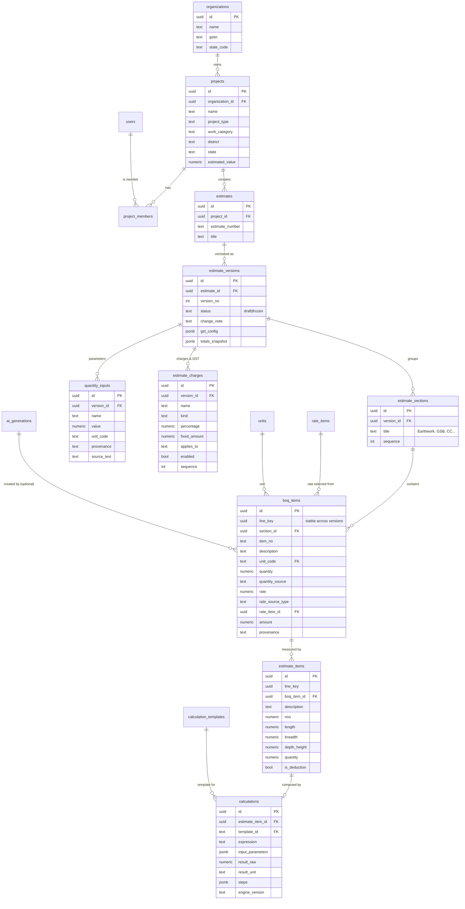
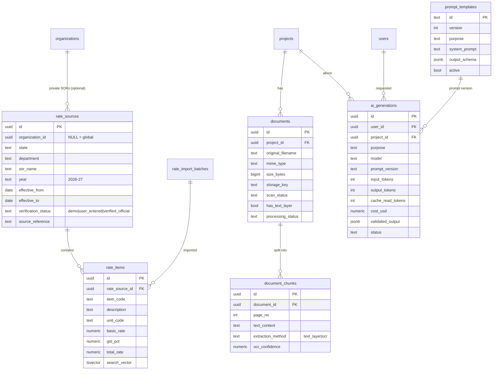
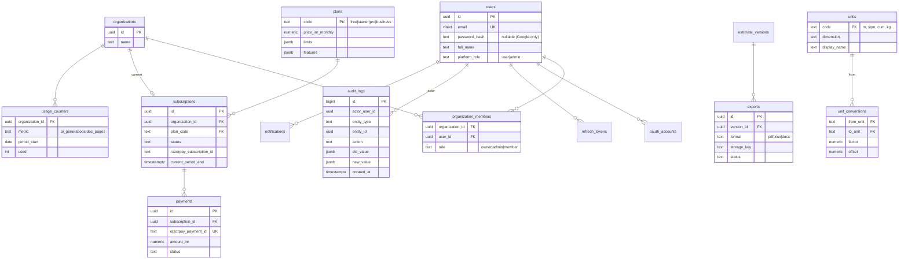

# 02 — Database ER Diagram

The full DDL is in [`03-database-schema.sql`](./03-database-schema.sql). This page shows the relationships.

## 2.1 Terminology used by the schema

Indian estimates have two levels, and the table names follow them:

| Table | What it represents | Example |
|---|---|---|
| `boq_items` | A **priced item** of the BOQ / abstract: description, unit, quantity, rate, amount | "PCC M15 for CC road — 825.000 Cum @ ₹6,450 = ₹53,21,250.00" |
| `estimate_items` | A **measurement line** of the detailed estimate under a BOQ item: L, B, D/H, No., quantity, deduction flag | "Chainage 0–500: 1 × 500 × 5.5 × 0.15 = 412.500" |
| `calculations` | The immutable **calculation record** behind a measurement line: template, expression, inputs, result, engine version | `road_layer`, `500 × 5.5 × 0.15`, 412.500 cu.m |
| `quantity_inputs` | **Named parameters** at version level that formulas can reference | `road_length = 1 km`, `cc_thickness = 150 mm` |

A BOQ item's quantity is the sum of its measurement lines (deductions subtract). If a BOQ item has no measurement lines, it is a manual quantity with `quantity_source = manual`.

## 2.2 Core estimating model

## 2.3 Rates, documents, AI

## 2.4 Identity, billing, platform

## 2.5 Tables beyond the brief's list

The brief listed 22 tables. The design adds these, each for a concrete reason:

| Added table | Why |
|---|---|
| `organization_members` | Users can belong to several orgs (Business plan, consultants working for multiple firms). |
| `oauth_accounts`, `refresh_tokens` | Google login, secure refresh-token rotation. |
| `estimates` | A project can hold several estimates (e.g. preliminary vs detailed, or Road vs Drain packages). Versions hang off an estimate, not a project. |
| `estimate_sections` | Abstract grouping (Earthwork, GSB, CC …). |
| `estimate_charges` | Contingencies, WCE, labour cess, seigniorage, and so on, as configurable rows. |
| `calculation_templates` | Versioned formula catalogue shared by the engine and the AI prompt. |
| `rate_import_batches` | Traceability and rollback of a CSV/Excel import. |
| `plans`, `usage_counters` | Configurable pricing and quota enforcement. |
| `prompt_templates`, `feature_flags` | Admin-managed prompts and flags. |
| `jobs` | Background job status and progress. |
| `webhook_events` | Idempotent payment webhook processing. |

## 2.6 Cross-cutting column conventions

* Primary keys: `uuid` (v7, time-ordered, generated in app) except append-only logs (`bigint identity`).
* Every tenant-owned row carries `organization_id` directly (denormalised), so every query can filter on it without joins. It is indexed.
* Money: `numeric(16,2)` INR. Rates: `numeric(14,2)`. Quantities: `numeric(18,3)` stored plus `numeric(28,10)` raw. Percentages: `numeric(7,4)`.
* `provenance` enum on quantities, parameters and rates: `user_entered | ai_extracted | ai_suggested | default_accepted | document_extracted | drawing_derived | rate_database | calculated`.
* `created_at`, `updated_at`, `created_by`, `updated_by` on all mutable tables. Soft delete (`deleted_at`) on projects, estimates, documents.
